# **Shifru**

シフト管理アプリケーション

### アプリ URL: https://www.shifru.jp/login

## **概要**

**Shifru** は、飲食店のシフト管理を効率化するためのアプリケーションです。私が働く、飲食店のシフト管理は紙やエクセルなどを使ったアナログな方法が主流であり、店長はスタッフの希望シフトを個別に収集し、作成したシフトを1枚の紙に印刷して共有していました。これが業務効率を低下させたり、シフト共有の妨げなっていたりしました。
**Shifru** は、こうした課題を解決するために開発されたシフト管理アプリです。店長・スタッフそれぞれの役割に応じた機能を提供し、希望シフトの提出、シフトの閲覧、そして最終シフトを全スタッフに共有するところまでをスムーズに行えるようサポートします。従来の煩雑なアナログ管理をデジタル化することで、業務負担を軽減し、効率的なシフト運用を実現します。

## **ペルソナと現状の課題**

### **基本情報**

#### 職場の状況

    業種・業界：飲食業界
    勤務先の母体：約80店舗の飲食チェーン店
    勤務先の規模：徒歩10分圏内の２店舗(A店：10名以上、B店：20名以上)

#### 片貝 大希

    年齢：39歳
    勤務形態：正社員(店長)
    飲食店勤務に関わる悩み：
    - 仕事量が多い
    - 事務作業に割く時間がない
    - 人手不足で改善する時間がない

**店長の悩みから、自分でも解決できる範囲のシフトに焦点を当てました**

#### 片貝 大希

    シフトに関わる悩み：
    - LINEに送られたシフトをわざわざみてエクセルに入力するのが面倒
    - モデルシフト通りにシフトを組んでも戦力が足りないことがある
    - シフトをさらに違う媒体に登録する作業が面倒

#### 私：大塚 春希

    年齢：25歳
    勤務形態：アルバイト
    シフトに関わる悩み：
    ・ シフトが見ずらい
    ・ 自店でスタッフが足りてないので、足りてるところから補って欲しい
    ・ シフトの運用がアナログすぎる

#### 平本 遼介

    年齢：22歳(大学4年生)
    勤務形態：アルバイト
    シフトに関わる悩み：
    ・ 期限が曖昧で分かりずらい
    ・ 確定のシフトから勝手に変更がされている
    ・ 提出後に過不足があるところに追加、削除したい

#### 小林 真人

    年齢：22歳(大学4年生)
    勤務形態：アルバイト
    シフトに関わる悩み：
    ・ 確定のシフトが見ずらい
    ・ 期限を守らない人がいて店長が大変そう
    ・ 提出のフォーマットがみんな違くて店長が大変そう

#### 一瀬 愛

    年齢：20歳(大学2年生)
    勤務形態：アルバイト
    シフトに関わる悩み：
    ・ 誰が入っているか気になる
    ・ 提出するときに間違えた日付、時間で出してしまってる時がある

#### その他の人の悩み

    ・ シフトボードと連携して欲しい
    ・ LINEに打ち込むのめんどくさい
    ・ 店長へのLINEの文章を考えるのが面倒
    ・ 退勤時間がちゃんと書かれてない時がある

### **解決すべき課題の絞り込み**

シフト管理にはさまざまな課題がありますが、**まず最初に解決すべき重要な課題** に焦点を当てて、今回のShifruでは、以下の3つの課題に特化して開発を進めました。

#### **1. シフト提出の統一と簡略化**

#### **現状の課題**

- **LINEでシフトが提出される** ため、店長は手動でエクセルに入力しなければならない。
- 提出のフォーマットが統一されておらず、 **店長が整理するのに手間がかかる**。

#### **Shifruでの解決策**

- LINEでの提出を廃止し、**アプリ上で統一フォームから提出可能にする**
- 店長は**フォーマットが統一されたデータを受け取れる**ため、手作業の負担が軽減
- 提出ミスを防ぎ、データの整理がしやすくなる

#### **2. シフトの可視化**

#### **現状の課題**

- 提出したシフトがどのように反映されたのかが分かりにくい
- 確定したシフトが見づらく、スタッフ同士の調整もしづらい

#### **Shifruでの解決策**

- **シフト提出時に他のスタッフのシフトが確認できる**

  - 誰がどの日にシフト希望を出しているのかを、提出時にリアルタイムで表示
  - 「希望が集中している日」「人が足りない日」が **提出時点で分かる** ため、無駄な調整が減る

- **確定シフトをスマホで見やすいデザインに**
  - 提出されたシフトはテーブル形式で表示
  - **スタッフの名前を固定** し、スマホでも日付ごとにスクロールして見やすい設計
  - これにより、**シフトの全体像を直感的に把握しやすくなる**

#### **3. 提出期限の管理**

#### **現状の課題**

- 提出期限が曖昧で、守らない人が多いため、店長が催促する手間が発生
- 期限後に提出されることがあり、後から調整しなければならない

#### **Shifruでの解決策**

- **提出期限後はシフト提出ができない仕様**
- これにより、**期限後の提出対応や追加調整の負担を削減**
- 現状、期限前に**1度LINEでリマインドを送る運用**

## **主な機能**

Shifruでは、利用者の役割に応じて3種類の権限が設定されています。
3種類の権限：「管理者」「店長」「スタッフ」

#### **1. 管理者**

管理者は、複数の店舗をエリア単位で管理し、店長の登録を行う役割を持ちます。

- **エリア登録**：複数の店舗をエリア単位で管理可能
  - _例：エリアマネージャーが管轄エリアを設定_
- **店舗登録**：新規店舗の登録
  - _例：新しい店舗を追加し、店長をアサインする際に使用_
- **店長登録**：各店舗の責任者として店長を設定

<table>
  <tr>
    <td align="center">
      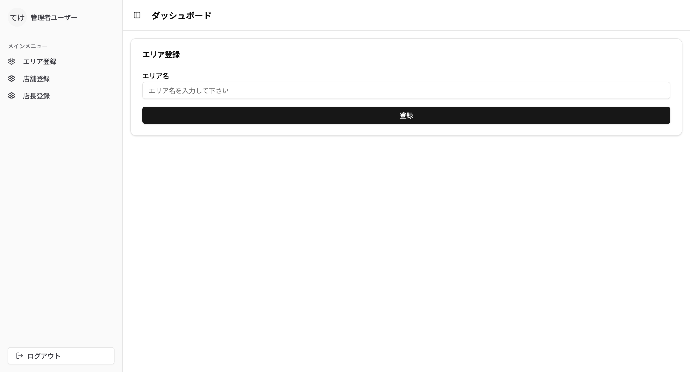
       
      <b>エリア登録画面</b>
    </td>
    <td align="center">
      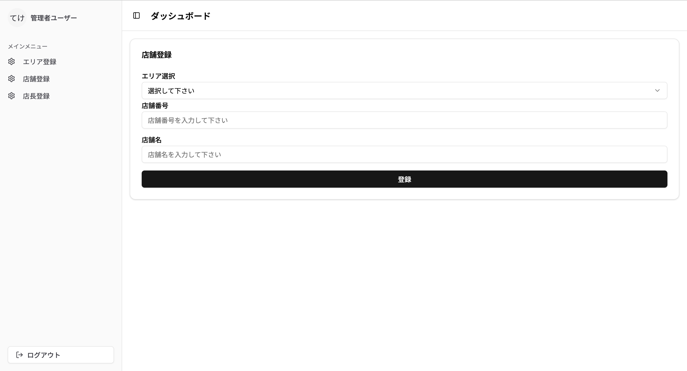
       
      <b>店舗登録画面</b>
    </td>
  </tr>
  <tr>
    <td align="center">
      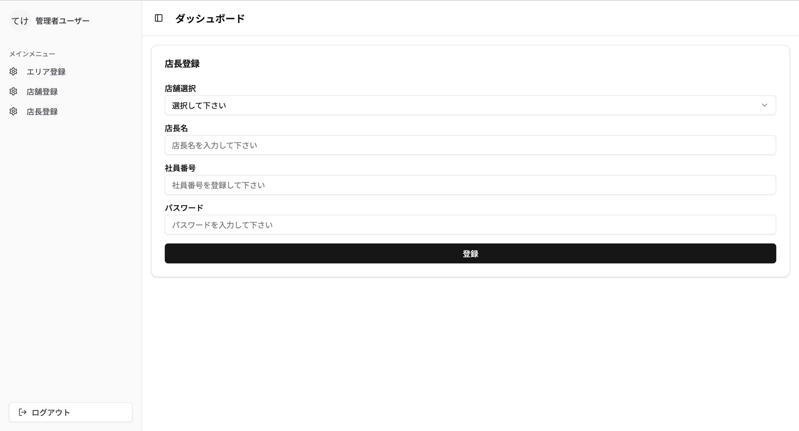
       
      <b>店長登録画面</b>
    </td>
  </tr>
</table>

---

#### **2. 店長**

店長は、自身の店舗のスタッフを管理し、シフトの確認を行います。

- **スタッフ登録**：従業員の登録
  - _新しくアルバイトを雇用した際に登録_
- **シフト閲覧**：店舗スタッフのシフトを確認
  - _例：全体のシフトを確認し、不足がある日程を把握_

<table>
  <tr>
    <td align="center">
      
       
      <b>スタッフ登録画面</b>
    </td>
    <td align="center">
      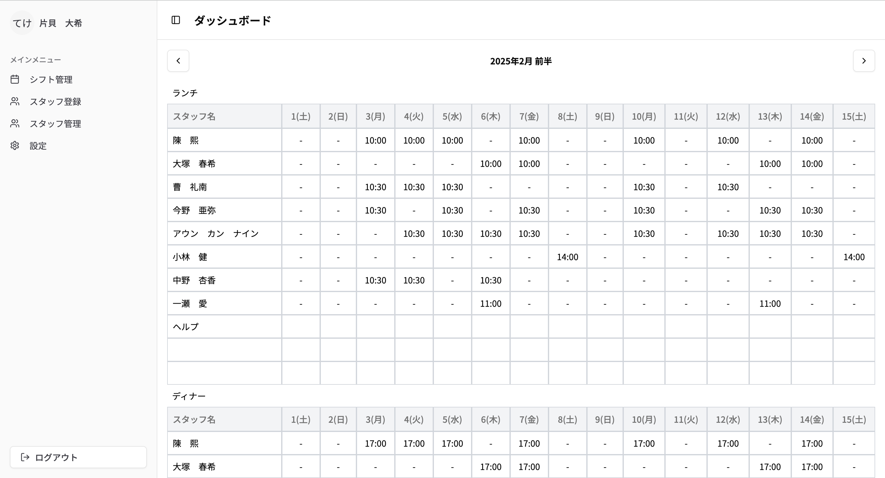
       
      <b>シフト閲覧画面</b>
    </td>
  </tr>
</table>

---

#### **3. スタッフ**

スタッフは自身のシフトを登録・確認し、必要に応じて修正を行えます。

- **個人シフト閲覧**：自身のシフトを確認
  - _例：自分の勤務スケジュールをアプリでいつでも確認_
- **全体シフト閲覧**：店舗のシフトを確認
  - _なぜ必要？_
    - 自分のシフトだけでなく、他のスタッフのシフトも把握することで、交換依頼や勤務調整がスムーズにできる。
- **シフト登録&編集**：希望シフトを提出
  - _例：毎月20日までに来月前半のシフト希望を登録_
  - _例：毎月 5日までに今月後半のシフト希望を登録_
- **シフト削除**：登録済みのシフトを削除
  - _例：期限内であれば、シフトの削除が可能_

<table>
  <tr>
    <td align="center">
      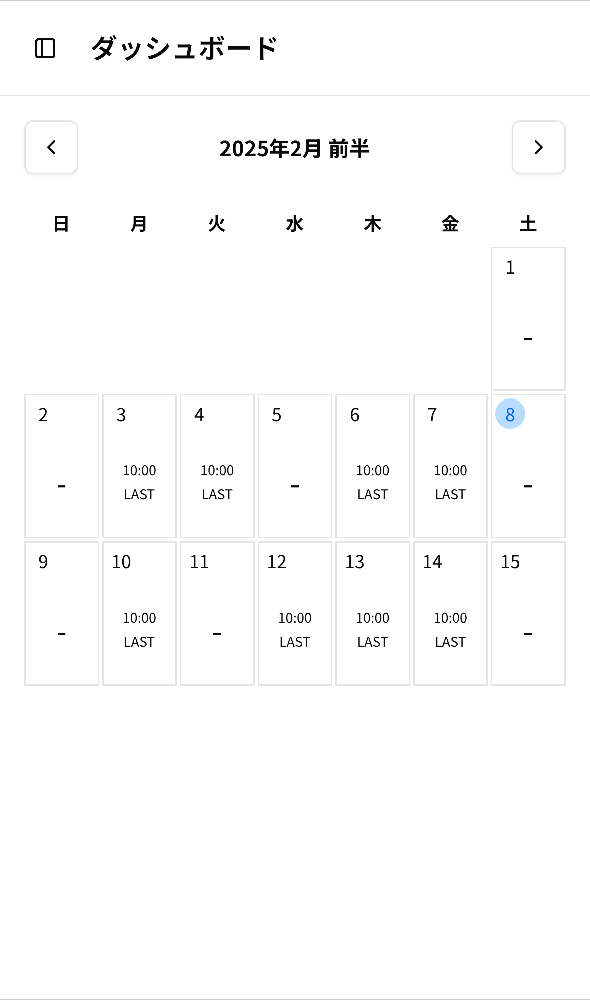
       
      <b>個人シフト閲覧</b>
    </td>
    <td align="center">
      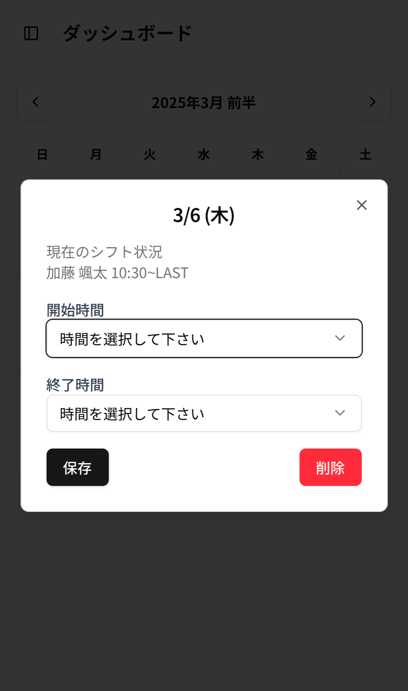
       
      <b>シフト登録&編集&削除</b>
    </td>
  </tr>
  <tr>
    <td align="center">
      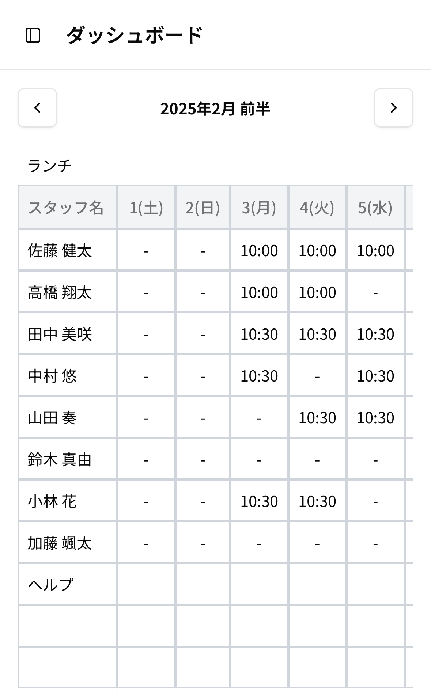
       
      <b>全体シフト閲覧</b>
    </td>
    <td align="center">
      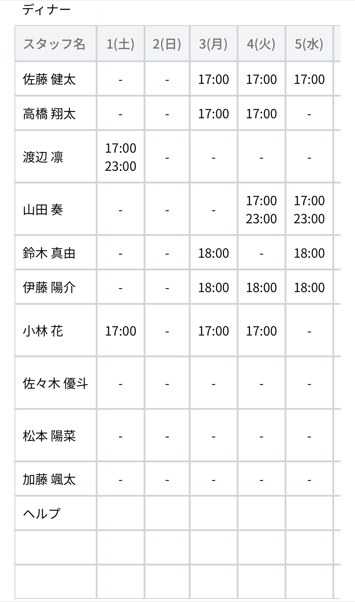
       
      <b>全体シフト閲覧</b>
    </td>
  </tr>
</table>

### **画面遷移図**

#### **1. 管理者**

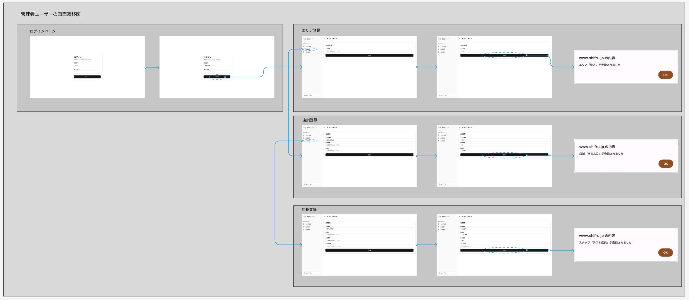

#### **2. 店長**

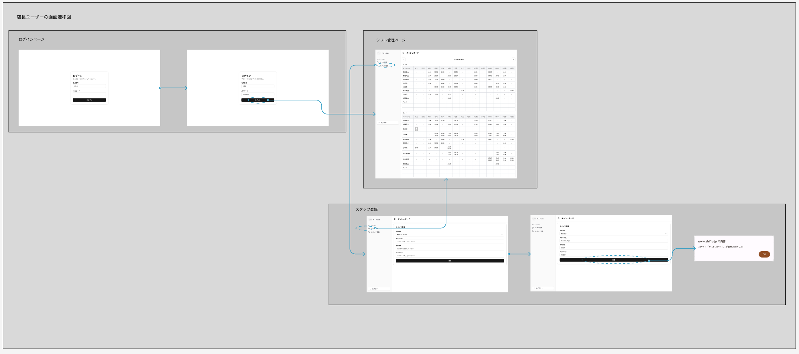

#### **3. スタッフ**

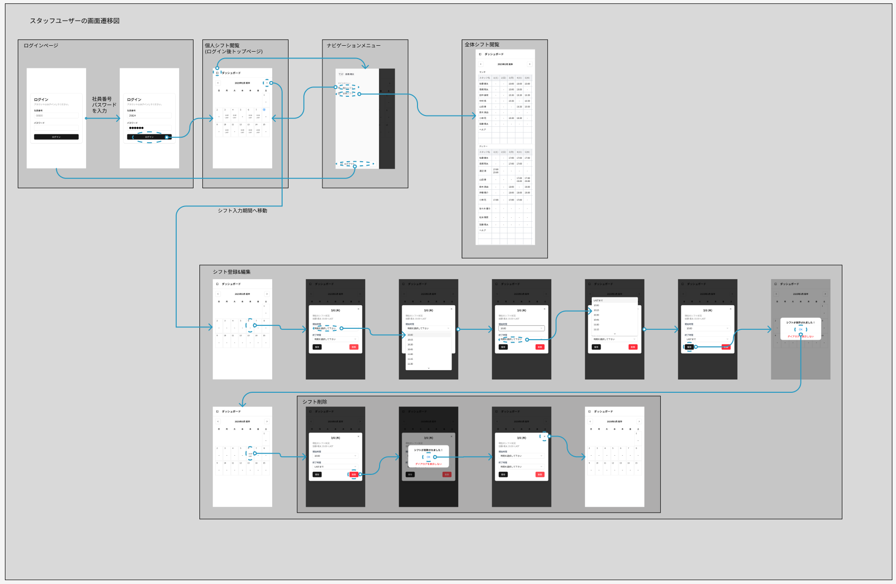

## **使用技術**

#### **フロントエンド**

- **言語**: HTML, CSS, JavaScript
- **ライブラリ**: React `^18`, Jotai `^2.10.3`
- **フレームワーク**: Next.js `^14.2.14`, Tailwind CSS `^3.4.1`, shadcn/ui
- **ツール**: ESLint `^8`, Prettier
- **データフェッチ**: Axios `^1.7.7`

#### **バックエンド**

- **言語**: Ruby `3.3.5`
- **フレームワーク**: Ruby on Rails `~> 7.0.8, >= 7.0.8.4`
- **セキュリティ・認証**:
  - bcrypt `~> 3.1.7`（パスワードハッシュ化）
  - JWT（JSON Web Token）
- **CORS制御**: rack-cors
- **開発ツール**:
  - 静的解析: RuboCop
  - Dockerサポート: dockerfile-rails `~> 1.6.25`

#### **データベース**

- MySQL `8.4`

#### **API設計**

- RESTful API

#### **認証・認可**

- JSON Web Token (JWT)

#### **状態管理**

- Jotai `^2.10.3`

#### **ログ・監視**

- Vercel・Fly.ioのログ機能を使用（エラーログ・アクセスログの確認）

#### **テスト**

- RSpec（バックエンド）

#### **インフラ・開発環境**

- **ホスティング・デプロイ**:
  - **フロントエンド**: Vercel（GitHub連携による自動デプロイ）
  - **バックエンド**: Fly.io
  - **データベース**: Fly.io
- **CI/CD**: Vercelの自動デプロイ機能
- **開発環境**:
  - **Docker（フロントエンド・バックエンド・データベース全体で使用）**
  - **バックエンドのDockerfile**:
    - **開発用**: `Dockerfile.dev`
    - **本番用**: `Dockerfile`
- **リポジトリ管理**: GitHub

---

[インフラ構成図のイメージをここに追加]  
Shifruのインフラは、フロントエンド（Next.js）を**Vercel**、バックエンド（Rails API）を**Fly.io**でホスティングし、データベースは**MySQL 8.4**を使用しています。  
Dockerを活用し、開発環境と本番環境を統一する設計になっています。
要確認!!!

## **ER図**

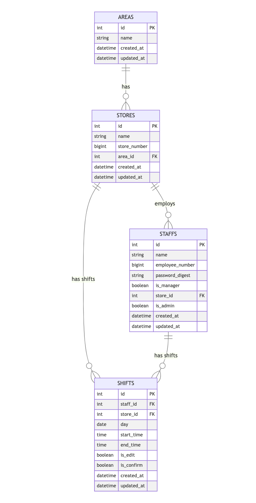

- **エリア**（areas）: エリア単位で店舗を管理
- **店舗**（stores）: 店舗ごとのシフトを管理
- **店長**（managers）: 店舗の責任者
- **スタッフ**（staffs）: シフトに登録可能な従業員
- **シフト**（shifts）: スタッフのシフト情報

## **今後の実装予定**

今回のShifruでは、「シフト提出・確認の効率化」 に特化しましたが、今後さらに改善すべき点もあります。
今後は以下の機能を実装する予定です。

- より洗練されたUI・UX
- 確定シフトの調整機能
- 確定シフトの変更履歴管理（提出されたシフトの保証）
- 提出期限の通知機能
- シフトの確定通知機能
- 他店舗との連携
- シフトの自動調整
