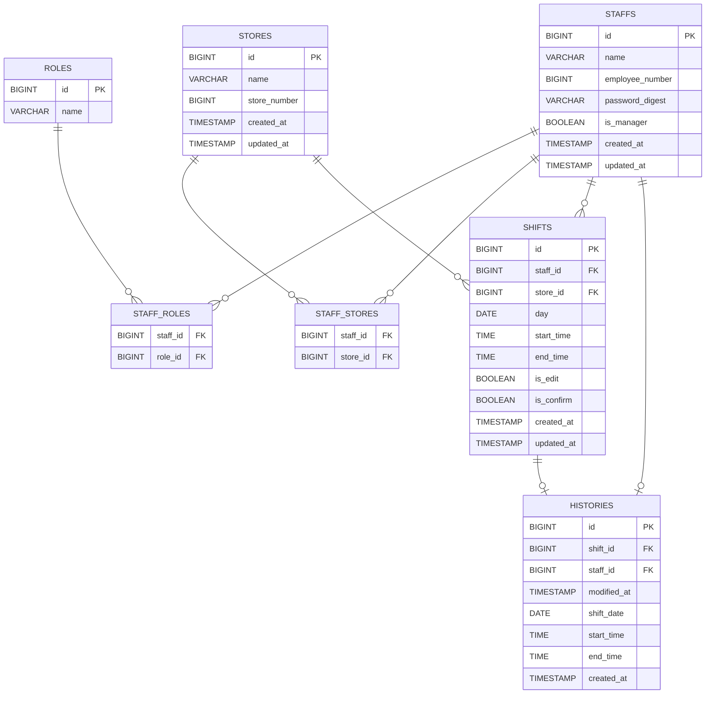

```mermaid
erDiagram
    STAFFS {
        BIGINT id PK
        VARCHAR name
        BIGINT employee_number
        VARCHAR password_digest
        BOOLEAN is_manager
        TIMESTAMP created_at
        TIMESTAMP updated_at
    }

    STORES {
        BIGINT id PK
        VARCHAR name
        BIGINT store_number
        TIMESTAMP created_at
        TIMESTAMP updated_at
    }

    SHIFTS {
        BIGINT id PK
        BIGINT staff_id FK
        BIGINT store_id FK
        DATE day
        TIME start_time
        TIME end_time
        BOOLEAN is_edit
        BOOLEAN is_confirm
        TIMESTAMP created_at
        TIMESTAMP updated_at
    }

    HISTORIES {
        BIGINT id PK
        BIGINT shift_id FK
        BIGINT staff_id FK
        TIMESTAMP modified_at
        DATE shift_date
        TIME start_time
        TIME end_time
        TIMESTAMP created_at
    }

    ROLES {
        BIGINT id PK
        VARCHAR name
    }

    STAFF_ROLES {
        BIGINT staff_id FK
        BIGINT role_id FK
    }

    STAFF_STORES {
        BIGINT staff_id FK
        BIGINT store_id FK
    }

    %% Relationships
    ROLES ||--o{ STAFF_ROLES : ""
    STAFFS ||--o{ STAFF_ROLES : ""
    STAFFS ||--o{ STAFF_STORES : ""
    STORES ||--o{ STAFF_STORES : ""
    STAFFS ||--o{ SHIFTS : ""
    STORES ||--o{ SHIFTS : ""
    SHIFTS ||--o| HISTORIES : ""
    STAFFS ||--o| HISTORIES : ""


```
