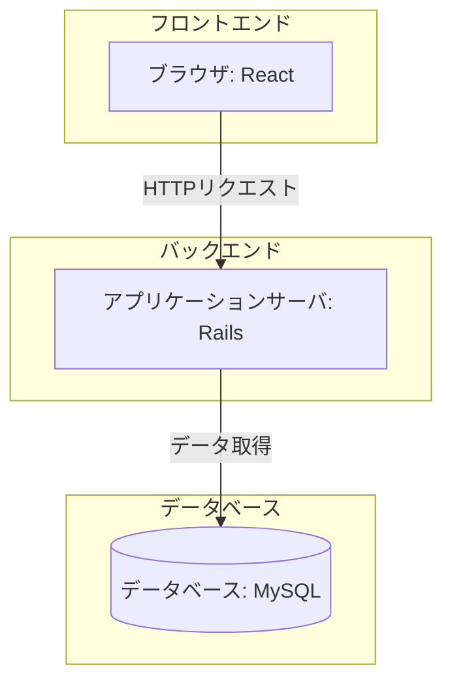

```mermaid
graph TD
  subgraph フロントエンド
    UI[ブラウザ: React]
  end

  subgraph バックエンド
    API[アプリケーションサーバ: Rails]
  end

  subgraph データベース
    DB[(データベース: MySQL)]
  end


  UI --> |HTTPリクエスト| API
  API --> |データ取得| DB
```
